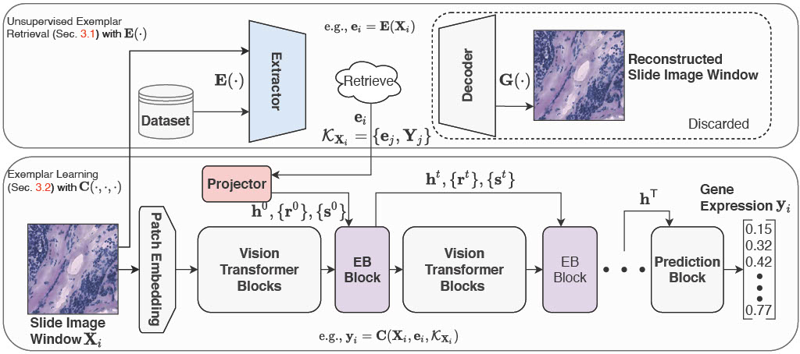
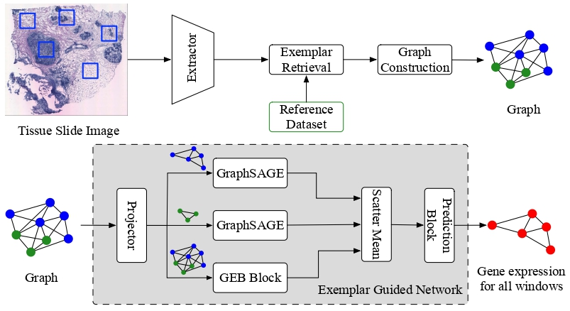

# Version 1: [Exemplar Guided Deep Neural Network for Spatial Transcriptomics Analysis of Gene Expression Prediction](./doc/egn.pdf)


## Dependency
* python 3.9.4
* pytorch_lightning 1.5.7
* numpy 1.23.3
* Pandas 1.5.2
* tifffile 2021.7.2
* Pillow 9.3.0
* scanpy 1.9.1
* torch 1.9.1+cu111
* torchvision 0.10.1+cu111
* einops  0.3.2

## Dataset
* Obtain [10xgenomics dataset](https://www.10xgenomics.com/resources/datasets?query=&page=1&configure%5Bfacets%5D%5B0%5D=chemistryVersionAndThroughput&configure%5Bfacets%5D%5B1%5D=pipeline.version&configure%5BhitsPerPage%5D=500&configure%5BmaxValuesPerFacet%5D=1000).

* We use slide image:
-- 1.0.0/V1_Breast_Cancer_Block_A_Section_1
-- 1.0.0/V1_Breast_Cancer_Block_A_Section_2 
-- 1.1.0/V1_Breast_Cancer_Block_A_Section_1
-- 1.1.0/V1_Breast_Cancer_Block_A_Section_2 
-- 1.2.0/Parent_Visium_Human_BreastCancer
-- 1.2.0/Targeted_Visium_Human_BreastCancer_Immunology 

* Structure the data files as follows.
```
└───10xgenomics
    └───1.0.0
    │   │ V1_Breast_Cancer_Block_A_Section_1
    |   | V1_Breast_Cancer_Block_A_Section_2
    │  
    │
    └───1.1.0
    |   │ V1_Breast_Cancer_Block_A_Section_1
    |   | V1_Breast_Cancer_Block_A_Section_2
    |   
    |
    └───1.2.0
    |   │ Parent_Visium_Human_BreastCancer
    |   | Targeted_Visium_Human_BreastCancer_Immunology
```


## Train EGN

* Change system directory
```bash
cd v1
```

*  Build index for exemplar retrival
```bash

for fold in {0..2}
do
python3 build_exemplar.py --index_dir index --save_dir exemplar --TORCH_HOME PLEASE Fill --data PLEASE Fill --fold $fold #Set torch home and data path properly, e.g., 10xgenomics 

done
```

* Gene expression prediction
```bash
for fold in {0..2}
do
	python3 main.py --num_nodes 1 --gpus 1 --epoch 50 --batch 32 --workers 6 --size 256 --data PLEAE FILL --fold $fold \
		--lr 5e-4 --weight_decay 1e-4 --dim 1024 --heads 16 --mlp_dim 4096 --depth 8 --bhead 8 --bdim 64  \
		--bfre 2 --player 2 --linear_projection True --index_path exemplar/index \
		        --emb_path exemplar --mdim 2048 --numk 6   #Set data path properly 
done  
```

# Version 2: [Spatial Transcriptomics Analysis of Gene Expression Prediction using Exemplar Guided Graph Neural Network](./doc/eggn.pdf)


## Dependency
* python 3.9.4
* pytorch_lightning 1.5.7
* numpy 1.23.3
* Pandas 1.5.2
* tifffile 2021.7.2
* Pillow 9.3.0
* scanpy 1.9.1
* torch 1.9.1+cu111
* torchvision 0.10.1+cu111
* torch-geometric  2.1.0.post1

## Train EGGN

* Change system directory
```bash
cd v2
```

*  Build index for exemplar retrival
```bash

for fold in {0..2}
do
python3 build_exemplar.py --index_dir index --save_dir exemplar --TORCH_HOME PLEASE Fill --data PLEASE Fill --fold $fold #Set torch home and data path properly 

done
```

* Build graphs
```bash

python3 generate_graph.py --savename 10xpro --size 256 --numk 6 --mdim 512 --index_path index --emb_path exemplar --data PLEASE Fill #Set data path properly 

```

* Gene expression prediction

```bash
for fold in {0..2}
do
python3 main.py  --gpus 1 --epoch 300 --fold $fold  --lr 5e-4 --weight_decay 1e-4 --mdim 512 --numk 6  --graph_path 10xpro --num_layers 4

done
```

## Code for Related Work
* STNet: https://github.com/bryanhe/ST-Net
* ViT: https://github.com/lucidrains/vit-pytorch
* GCN: https://pytorch-geometric.readthedocs.io/en/latest/tutorial/heterogeneous.html

## Notice
* This is a minimal exemple to train EGN and EGGN on the 10xgenomics dataset. If you want to use StyleGAN-based exemplar retrival, please refer to [S2FGAN](https://github.com/Yan98/S2FGAN). 
* There are some typos on the paper. We have updated the pdf. Please find it [here](./doc/egn.pdf).
* Please find the EGGN [here](./doc/eggn.pdf).
* We have refactored the code, and potential error may exists. If you have question related to our work, please drop [me](mailto:yan.yang@anu.edu.au?subject=[GitHub]EGN) an email.


## Citation
If you find [EGN](https://openaccess.thecvf.com/content/WACV2023/papers/Yang_Exemplar_Guided_Deep_Neural_Network_for_Spatial_Transcriptomics_Analysis_of_WACV_2023_paper.pdf) useful in your research work, please consider citing:
```bibtex
@inproceedings{egn2023,
  author    = {Yan Yang and
               Md. Zakir Hossain and
               Eric A. Stone and
               Shafin Rahman},
  title     = {Exemplar Guided Deep Neural Network for Spatial Transcriptomics Analysis
               of Gene Expression Prediction},
  booktitle = {{IEEE/CVF} Winter Conference on Applications of Computer Vision, {WACV}
               2023, Waikoloa, HI, USA, January 2-7, 2023},
  pages     = {5028--5037},
  publisher = {{IEEE}},
  year      = {2023},
  url       = {https://doi.org/10.1109/WACV56688.2023.00501},
  doi       = {10.1109/WACV56688.2023.00501},
}
```
